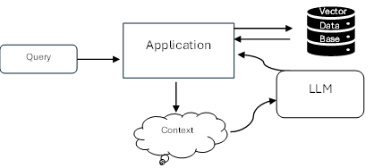
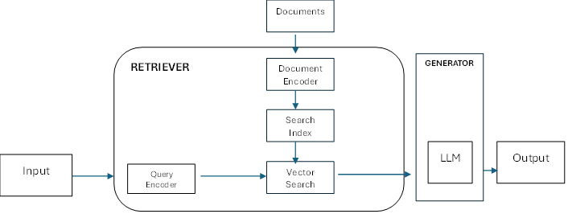
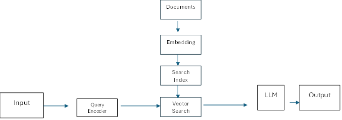

**RAG (Retrieval Augumented Generation) :**

A technical in AI where large language model accesses new or recent data outside its training set to provide better and improved results.

Key terms:

Vector Data Base: A search engine or data base that stores vectorized documents, enabling more accurate information retrieval for AI models
- Azure AI Search : One of the cloud based services provided by microsoft that offers RAG capabilities for LLM

Embedding : Representation of text data as vector in dimenstional space allowing similarity comparsion between different piece of text

Usually Query should navigate from User --> Framework --> LLM --> Response to User Query

RAG Works : 
- Steps 
    - 1 User Query - The process begins by sending a user query to application ( Whats the Weather ) 
    - 2 Application - Application receives query and initiate the workflow
    - 3 Vector DB (Stores more accurate information) - Query is passed to vector data base , which  stores and retrieves more accurate information relevant to user request
    - 4 LLM ( User Query + Context + Response from Vector Data Base) - LLM process the user query , incorporating the context and information received from Vector Data Base  and generate respone
    - 5 Application - Generated response is sent back through application to user

Reteiever Component:

Transforms input text into sequenxe of floating point numbers (a vector) using query encoder

Document Encoder: Stores document encoding in search index.

Search Index: Searches for document vector that are related to input query and convert document vectors back into text and return text as output.

Generator : Takes userinput and matched document combine them into prompt and ask LLM to reply user.

Transformer :
- Query Encoder 
- Document Encoder
- LLM (encoder + decoder)

Encoder : convert text into vector
Decoder : Generate new text based on input text

Search Document : 
- Retrieval : Step compares user query with document search index and retrieve more relevant document.

key techniques: 
- Search
- Vector Search
- Hybrid Search

 Ranking : Optional step follows retrieval, it takes list of document that were found relevent by retrieval and improves an order in which they are ranked

Types of Retrieval: 
- Keyword Search : Uses exact term in the user input and search an index for documents that matching  text. Matching is done based on the text only and vectors not involved

    example: Searching User-ID, Product code, Address
    

- Vector Search (Dense Retrieval): It can retrieve or find matches when no search terms are presented in documents. It supports unstructured text rather than precised text 

    
    Embedding Model : Translate input text and each of document into corresponding embedding

    Embedding : Its a vector of floating numbers that roughly captures the general idea of text it encodes
    if two pieces of text are related, corresponding embedding vectors are similar
    E.g: 
    a = Do you have some recommendation for specific apartment close to sea
    b= "3 rooms house with ocean view"
    c= "I want donut"

    Types of Embedding Method: 
    - Dot Product :
    - Cosine Method : 
    - Euclidean Distance

- Hybrid Search: (Keyword Search) + (Dense Search) 

Semantic Ranking : Retrieval step does its best ranking to the returned documents based on how relevent they are to the user query

Cloud Based GEN AI Application: 

AI systems that utilizes cloud services for deployment ofen as an HTTP - API, enabling accessability and scalability.
